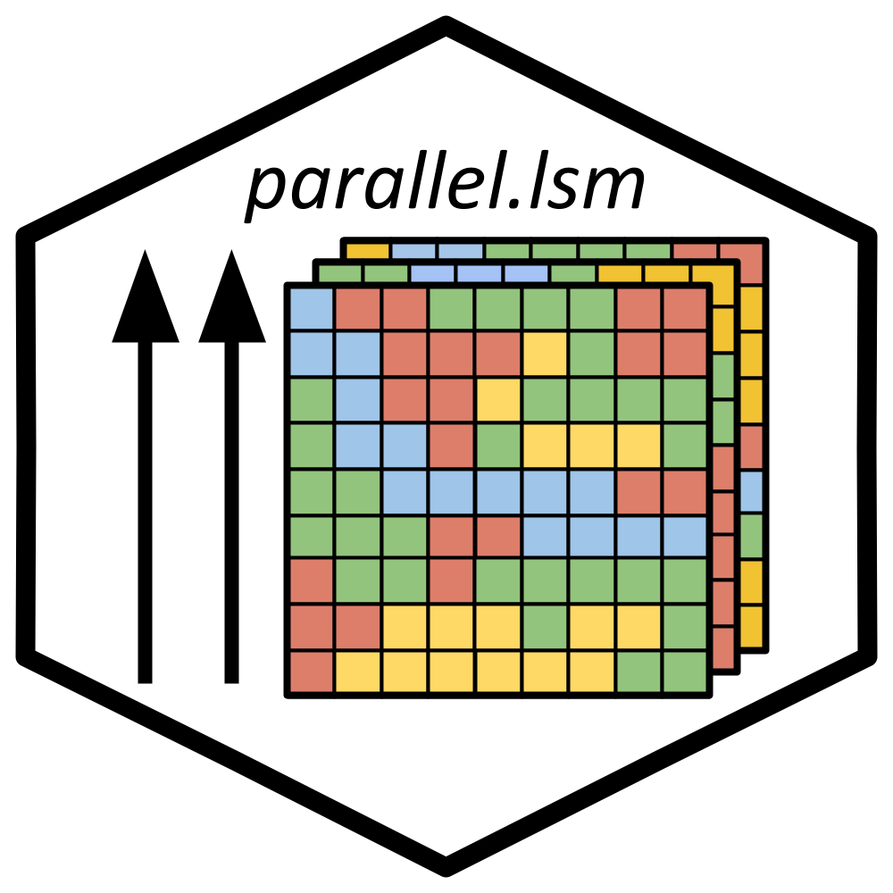

<!-- README.md is generated from README.Rmd. Please edit that file -->

# *parallel.lsm* 

<!-- badges: start -->

[](https://github.com/oxyppgyn/parallel.lsm/actions/workflows/R-CMD-check.yaml)

<!-- badges: end -->

**This package is feature complete and is not expected to have any
future major updates.**

*parallel.lsm* provides alternative versions of *landscapemetrics*
functions that use parallelization with the goal of reducing processing
time for large rasters or datasets. Parallel processing is not used
within *landscapemetrics* itself, these wrappers are mainly useful when
you must calculate many metrics across landscapes or a very large set of
sample points (either can be split between CPU cores).

If it doesn’t take an excessive amount of time to run your landscape
calculations or you can’t split your data outside of *landscapemetrics*,
this package unfortunately is not the solution to use. The cost of
starting up parallel processes can outweigh the speed increase you may
obtain. Consider if your dataset is large enough to offset this when
choosing to use *parallel.lsm*.

## Functionality

the function `parallel.lsm()` allows wrapping any function from
*landscapemetrics* as a parallel alternative. For convenience,
variations of almost every *landscapemetrics* function exist in the
format `parallel.*()`—these are functionally the same as
`parallel.lsm()` without needing to specify a `func` argument.

All functions require splitting data into lists first, then specifying
which argument(s) contain elements that were split (using the `split_on`
argument). For spatial data, *terra* provides `split()`, which can be
used to divide points, polygons, or rasters into roughly equal groups.
`split_on` can be used for multiple arguments if you want to break up a
large set of sampling points but still need to provide proper plot ID
values. The number of workers/cores to use is determined by how many
splits were made in the dataset.

Note that all functions aside from `parallel.lsm()` and
`list_parallel.lsm()` are created when the package is loaded. The
functions available to you will reflect the version of
*landscapemetrics* you have installed.

## How to Install

*parallel.lsm* can be installed from Github using one of the options
below.

``` r
#Depricated, use for older R versions
devtools::install_github("oxyppgyn/parallel.lsm")
```

``` r
#Most up-to-date method
pak::pak("oxyppgyn/parallel.lsm")
```

Don’t forget to import after!

``` r
library(parallel.lsm)
```
